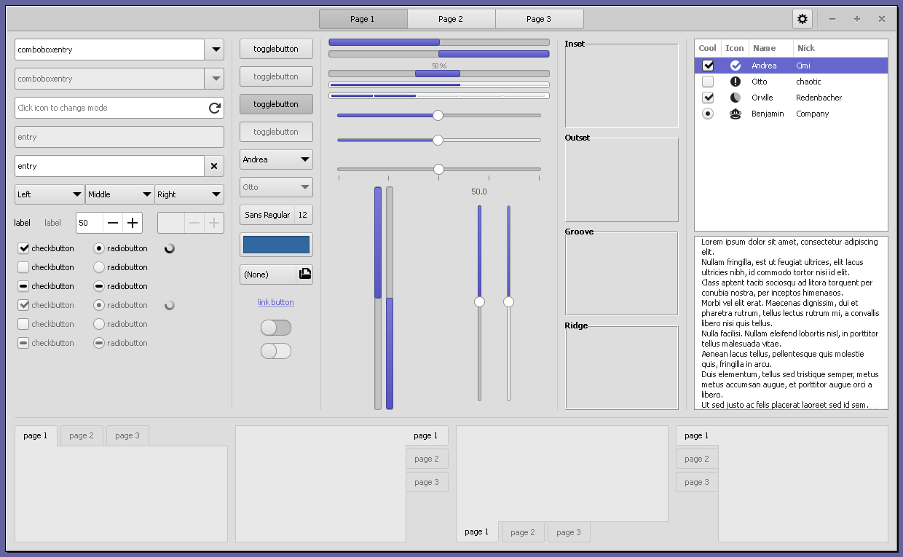
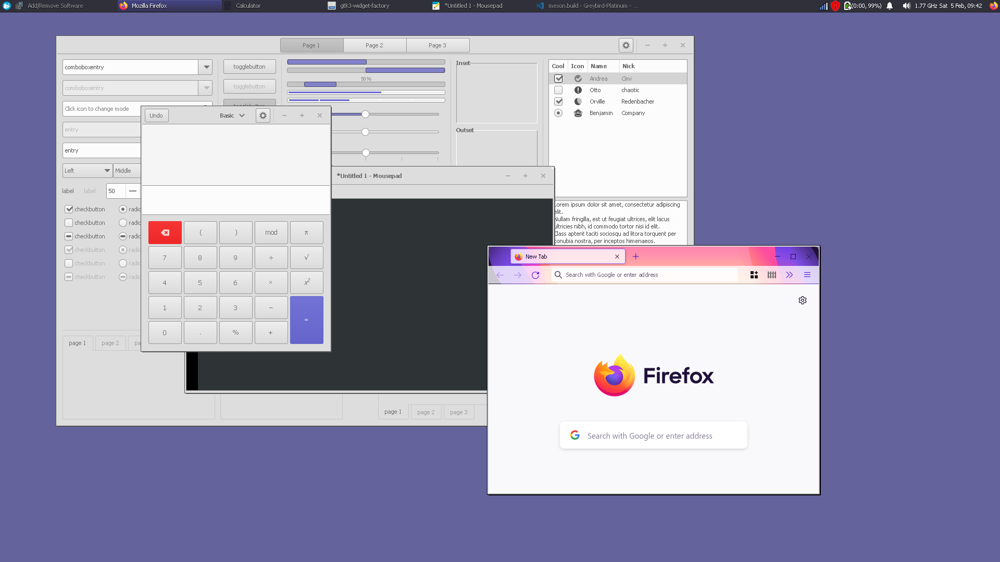

Greybird-Platinum
=======

Modification of the Greybird theme with elements of the 90s-era "Platinum" look. 



Only the GTK3 Theme was changed, for now at least. 

About Greybird
----------------------
URL: https://github.com/shimmerproject/Greybird

Copyright 2009–2019 Simon Steinbeiß, Satyajit Sahoo, Pasi Lallinaho, Carson Black, Maurizio Galli

Greybird is dual-licensed as GPLv2 or later and CC-BY-SA 3.0 or later.

Greybird is the default theme in Xubuntu 11.04 onwards.

The Greybird desktop suite includes:
- Gtk+2 theme
- Gtk+3 theme
- Xfwm4 themes (normal and compact)
- xfce-notifyd theme (dark and bright)
- Emerald theme
- Metacity theme
- Mutter theme
- Gnome Shell theme
- Plank theme
- Unity support

Dependencies for Gtk+2 support:
- gtk2-engines-murrine (>= 0.90)

The Gtk+3 theme uses the builtin engine and consequently has no dependencies.

### Build dependencies ###
Debian or Ubuntu:

`sudo apt install autoconf libgdk-pixbuf2.0-dev libglib2.0-bin librsvg2-dev meson ruby-sass sassc`

Fedora:

`dnf install gdk-pixbuf2-devel librsvg2-devel meson rubygem-sass`

openSUSE:

`zypper in fdupes gdk-pixbuf-devel gdk-pixbuf-loader-rsvg glib2-devel meson sassc`

### Build and Install ###

For Arch Linux Users, a PKGBUILD file exists at https://github.com/ClassicOS-Themes/Greybird-Platinum-PKGBUILD

#### Local (User) Install ####

```
meson --prefix=$HOME/.local builddir
cd builddir
ninja
ninja install
ln -sf ~/.local/share/themes ~/.themes # Required for GTK2
```

#### System Install ####

```
meson --prefix=/usr builddir
cd builddir
ninja
ninja install
```

You don't need to use `sudo` anywhere in the build and install process, as Ninja will elevate with polkit when needed.
